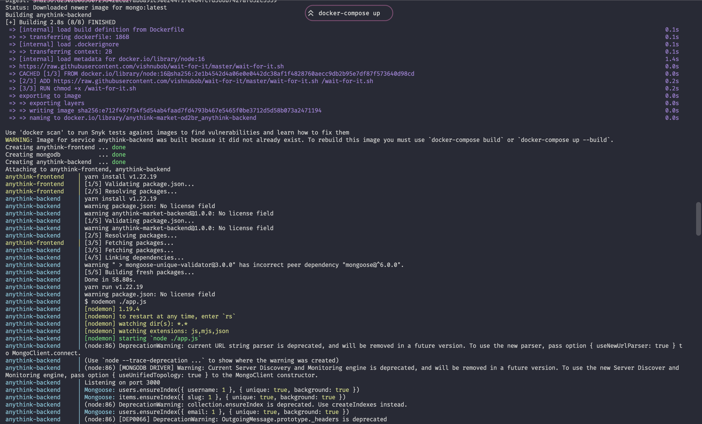

# Welcome to the Anythink Market repo

To start the app use Docker. It will start both frontend and backend, including all the relevant dependencies, and the db.

Please find more info about each part in the relevant Readme file ([frontend](frontend/readme.md) and [backend](backend/README.md)).

## Development

When implementing a new feature or fixing a bug, please create a new pull request against `main` from a feature/bug branch and add `@vanessa-cooper` as reviewer.

## First setup

#### Backend setup
- Clone this repo
<br>
- Install [Docker](https://docs.docker.com/get-docker/) for your machine if you don't already have it installed.
<br>
- To confirm if you have docker installed, run the following command in your terminal:

  ```bash
    docker -v && docker-compose -v
  ```
- In your terminal, navigate into the cloned project folder.
  <br>
- You need to start up docker to run the backend of this application, you can do that my running the following command from the project root directory to load Anythink's backend and frontend:
  ```bash
  docker-compose up
  ```

* Running the above command will automatically start the backend of the application, wait for docker to complete pulling the right images. You should see the following in your terminal if the backend server started successfully
  

* Navigate to [ http://localhost:3000/api/ping]( http://localhost:3000/api/ping) to test backend.

#### Frontend Setup

- In a different terminal tab, navigate into the frontend folder and run the following command:
  ```bash
  yarn install
  ```
- The above will install all the required dependencies for the frontend to run. To start the frontend server, run the following command:
  ```bash
  yarn run start
  ```

- Navigate to [localhost:3001](http://localhost:3001) to see the frontend of the application.
